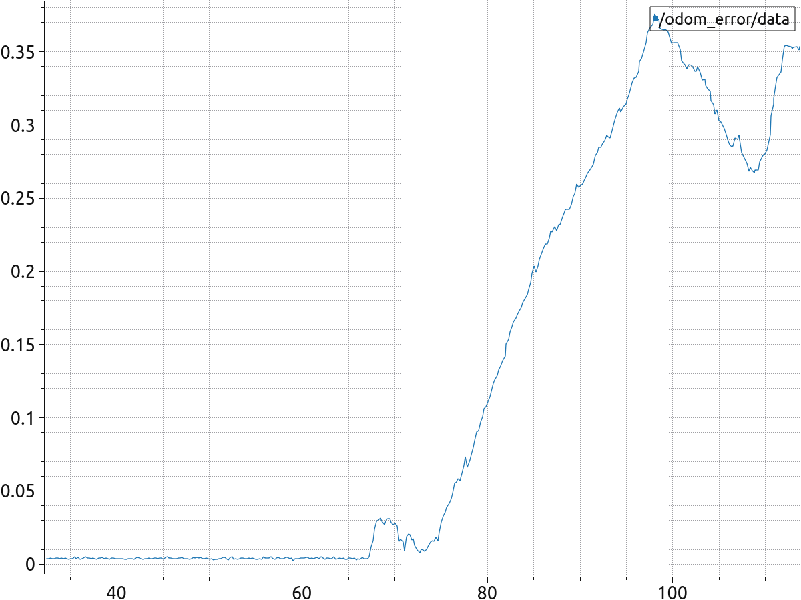

# LIO_SAM
FSE 598 Final Project 
This pronect is forked from: 

https://github.com/linzs-online/robot_gazebo

## Introduction
In this project, Lio_SAM is implemented over a UGV in an indoor environment.
### Dependencies
## Installation
Follow the below commands to install the packages.
```
cd ~/catkin_ws/src
git clone https://github.com/anuragvvworkspace/LIO_SAM`
cd ..
catkin_make
source devel/setup.bash
```
Instructions to run:
1) Run the gazebo simulation 

`roslaunch scout_gazebo scout_gazebo.launch'

2) Run Lio_sam

'roslaunch lio_sam run.launch'

3) Run odom_error publisher

'rosrun waypoint_pkg rmse.py'

4) Run plotjuggler and plot the /odom_error topic (Install plotjuggler)

5) Use teleop_keyboard inputto move the ugv around. You can install teleop_twist_keyboard at http://wiki.ros.org/teleop_twist_keyboard

`rosrun teleop_twist_keyboard teleop_twist_keyboard.py`

or Run navigation script to autonomously move UGV.

`rosrun waypoint_pkg navscript.py`


## Results

[](https://youtu.be/s9qx1QAzJls)

Plot of /odom_error




